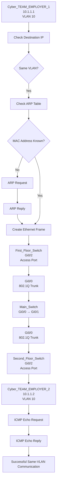

# 🧪 VLAN_TRUNKING_LAB

## 🎯 Objective

Build a multi-switch LAN using VLANs and 802.1Q trunking to understand VLAN segmentation, access ports, trunk links, VLAN communication, and Layer 2 isolation.

 

## 🖥️ Topology

  

## 🌐 IP Addressing

| Device           | VLAN | IP Address | Subnet Mask   |
| ---------------- | ---: | ---------- | ------------- |
| Cyber_EMPLOYER_1 |   10 | 10.1.1.1   | 255.255.255.0 |
| Cyber_EMPLOYER_2 |   10 | 10.1.1.2   | 255.255.255.0 |
| IT_EMPLOYER_1    |   20 | 10.2.2.1   | 255.255.255.0 |
| IT_EMPLOYER_2    |   20 | 10.2.2.2   | 255.255.255.0 |

 

## 🔧 Technologies

* EVE-NG
* Cisco IOS
* VPCS
* IPv4
* VLAN
* Ethernet
* IEEE 802.1Q
* ICMP
* MAC Address Table

 

## ⚙️ Configuration & Verification

### 🔹 VLAN Configuration

  

### 🔹 Access Port Configuration

  

### 🔹 802.1Q Trunk Configuration

  

### 🔹 VLAN & Trunk Verification

  

## 📊 Communication Process

### Same-VLAN Communication — Cyber Team

 

## 🔒 Layer 2 VLAN Isolation

### Cyber Team — VLAN 10

`10.1.1.1` ↔ `10.1.1.2`

✅ Communication successful

 

### IT Team — VLAN 20

`10.2.2.1` ↔ `10.2.2.2`

✅ Communication successful

 

### Cyber Team ↔ IT Team

`VLAN 10` ↛ `VLAN 20`

❌ Communication blocked

**Reason:** VLAN 10 and VLAN 20 are separate Layer 2 broadcast domains, and no Layer 3 routing is configured between them.

 

## 📸 Connectivity Verification

  

## ✅ Result

* Cyber_EMPLOYER_1 and Cyber_EMPLOYER_2 successfully communicated within **VLAN 10**.
* IT_EMPLOYER_1 and IT_EMPLOYER_2 successfully communicated within **VLAN 20**.
* Communication between the Cyber and IT teams was blocked because they belong to different VLANs.
* No Layer 3 routing was configured between VLAN 10 and VLAN 20.

This lab successfully demonstrated **same-VLAN communication, 802.1Q trunking, VLAN segmentation, MAC address learning, ARP, and Layer 2 isolation**.

 

## 📚 Key Learning

This lab helped me understand:

* VLAN segmentation
* Access port configuration
* 802.1Q trunking
* Allowed VLANs
* Inter-switch VLAN communication
* MAC address learning
* ARP resolution
* Same-VLAN communication
* Layer 2 broadcast-domain isolation
* Difference between Layer 2 switching and Layer 3 routing
