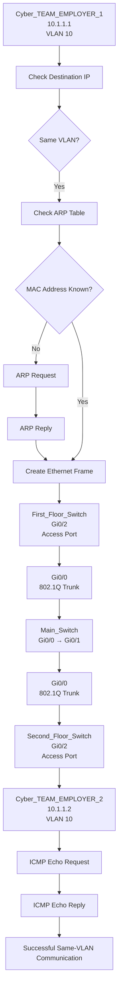

# 🧪 VLAN_TRUNKING_LAB

## 🎯 Objective

Build a multi-switch LAN using VLANs and 802.1Q trunking
to understand VLAN segmentation, access ports, trunk links,
VLAN communication, and Layer 2 isolation.

## 🖥️ Topology

       
## 🌐 IP Addressing

| Device | VLAN | IP Address | Subnet Mask |
|---|---:|---|---|
| Cyber_EMPLOYER_1 | 10 | 10.1.1.1 | 255.255.255.0 |
| Cyber_EMPLOYER_2 | 10 | 10.1.1.2 | 255.255.255.0 |
| IT_EMPLOYER_1 | 20 | 10.2.2.1 | 255.255.255.0 |
| IT_EMPLOYER_2 | 20 | 10.2.2.2 | 255.255.255.0 |

## 🔧 Technologies

- EVE-NG
- Cisco IOS
- VPCS
- IPv4
- VLAN
- Ethernet
- IEEE 802.1Q
- ICMP
- MAC Address Table
  

.
.
.
.

.
.
.
.

.
.
.
.

.

## 📊 Communication Process

### Same VLAN Communication

## 📊 Communication Process

### Same VLAN Communication — Cyber Team

## ✅ Result

Cyber_EMPLOYER_1 and Cyber_EMPLOYER_2 successfully communicated with each other within VLAN 10.
IT_EMPLOYER_1 and IT_EMPLOYER_2 successfully communicated with each other within VLAN 20.
Communication between the Cyber and IT teams was blocked because they belong to different VLANs and no Layer 3 routing was configured.
This successfully demonstrated same-VLAN communication and Layer 2 VLAN isolation.

## 📚 Key Learning

- VLAN segmentation
- VLAN 10 and VLAN 20
- Access ports
- 802.1Q trunking
- Allowed VLANs
- MAC address learning
- Broadcast domains
- Layer 2 communication
- VLAN isolation
- Basic Layer 2 troubleshooting

